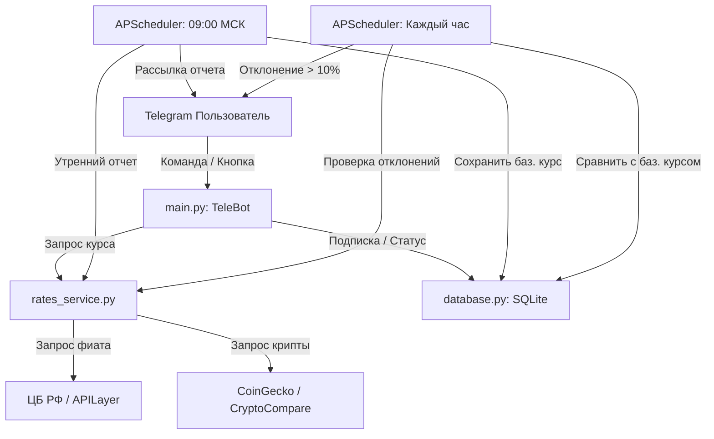

# 📐 Архитектура, Структура и Логика Работы Проекта

Данный документ содержит полное описание архитектуры, структуры файлов и алгоритмов работы Telegram-бота для отслеживания курсов валют и криптовалют.

---

## 📁 Структура Файлов Проекта

```text
d:\python\telegramm_bot\
├── main.py                     # Главная точка входа, обработчики команд и сообщений Telegram
├── config.py                   # Модуль конфигурации (загрузка переменных из .env)
├── database.py                 # Менеджер базы данных SQLite (подписчики, утренние курсы, алерты)
├── rates_service.py            # Сервис получения курсов фиатных валют (USD, EUR, CAD, GBP) и криптовалют (KAS, XMR)
├── scheduler.py                # Фоновый планировщик задач (рассылка в 09:00 МСК и часовые алерты >10%)
├── requirements.txt            # Зависимости Python
├── .env.example                # Шаблон конфигурационного файла для токенов и настроек
├── .env                        # Рабочий файл с токеном и параметрами
├── telegram_bot.service        # Файл службы systemd для автозапуска и работы 24/7 на Linux VPS
├── Dockerfile                  # Контейнеризация проекта для запуска через Docker
├── README.md                   # Краткая инструкция по установке и запуску
└── PROJECT_STRUCTURE.md        # Настоящий документ с подробным описанием логики
```

---

## ⚙️ Описание Компонентов и Модулей

### 1. `config.py` — Конфигурация
- **Назначение**: Безопасная загрузка настроек из файла `.env` и переменных окружения.
- **Основные параметры**:
  - `BOT_TOKEN`: Токен Telegram-бота, полученный от `@BotFather`.
  - `API_KEY`: (Необязательно) API-ключ для APILayer.
  - `ADMIN_CHAT_ID`: (Необязательно) Telegram ID администратора.
  - `DB_PATH`: Путь к файлу базы данных (по умолчанию `bot_data.db`).
  - `TIMEZONE`: Часовой пояс планировщика (по умолчанию `Europe/Moscow`).
  - `DEVIATION_THRESHOLD_PERCENT`: Порог срабатывания алертов в процентах (по умолчанию `10.0`%).

---

### 2. `database.py` — База Данных (SQLite)
- **Назначение**: Хранение данных между перезапусками бота и сервера.
- **Таблицы в БД (`bot_data.db`)**:
  1. `subscribers`:
     - `chat_id` (INTEGER PRIMARY KEY) — ID чата Telegram.
     - `username` (TEXT) — Никнейм пользователя.
     - `subscribed_at` (TIMESTAMP) — Дата и время подписки.
  2. `baseline_rates`:
     - `date` (TEXT) — Дата в формате `YYYY-MM-DD`.
     - `currency` (TEXT) — Код валюты (`USD`, `EUR`, `CAD`, `GBP`, `KAS`, `XMR`).
     - `rate` (REAL) — Утренний базовый курс в рублях на 09:00 МСК.
     - `updated_at` (TIMESTAMP) — Время записи.
  3. `alerts_log`:
     - `date` (TEXT) — Дата.
     - `currency` (TEXT) — Валюта.
     - `alerted_rate` (REAL) — Курс в момент срабатывания алерта.
     - `baseline_rate` (REAL) — Утренний базовый курс.
     - `deviation_percent` (REAL) — Процент отклонения.
     - `created_at` (TIMESTAMP) — Время срабатывания.

---

### 3. `rates_service.py` — Сервис Котировок
- **Назначение**: Получение актуальных курсов всех валют с поддержкой резервных источников (Failover).
- **Логика запроса курсов**:
  - **Фиатные валюты (USD, EUR, CAD, GBP)**:
    - *Основной/Бесплатный источник*: Официальный API Центрального Банка РФ (`https://www.cbr-xml-daily.ru/daily_json.js`). Не требует API ключей, работает стабильно и без лимитов.
    - *Дополнительный источник*: APILayer `exchangerates_data` (используется автоматически, если в `.env` указан `API_KEY`).
  - **Криптовалюты (Kaspa - KAS, Monero - XMR)**:
    - *Основной источник*: CoinGecko API (`api.coingecko.com`).
    - *Резервный источник*: CryptoCompare API (`min-api.cryptocompare.com`).
- **Итоговый метод `get_all_rates()`**: Запрашивает фиат + крипту и возвращает единый словарь курсов к рублю:
  ```python
  {'USD': 84.10, 'EUR': 96.37, 'CAD': 60.06, 'GBP': 112.36, 'KAS': 3.56, 'XMR': 47797.0}
  ```

---

### 4. `scheduler.py` — Планировщик и Алерты
- **Назначение**: Автоматическое выполнение фоновых задач по расписанию в часовом поясе `Europe/Moscow`.
- **Основные задачи (Jobs)**:
  1. **Утренний фиксатор и отчет (Ежедневно в 09:00 МСК)**:
     - Метод `run_daily_baseline()`.
     - Запрашивает текущие курсы всех 6 валют.
     - Сохраняет их в таблицу `baseline_rates` как утреннюю базовую точку дня.
     - Формирует и рассылает всем подписчикам сводный утренний отчет.
  2. **Ежечасовая проверка отклонений (Каждый час в :00 минут)**:
     - Метод `run_hourly_check()`.
     - Запрашивает утренние базовые курсы за сегодня out of DB.
     - Если бот был запущен после 09:00 и базовые курсы за сегодня еще не созданы, устанавливает текущие курсы в качестве базовых.
     - Запрашивает свежие курсы валют.
     - Вычисляет процент отклонения:
       $$\text{Отклонение (\%)} = \frac{\text{Текущий курс} - \text{Утренний курс}}{\text{Утренний курс}} \times 100\%$$
     - Если $|\text{Отклонение}| \ge 10\%$:
       - Проверяет по таблице `alerts_log`, отправлялся ли уже алерт по этой валюте сегодня.
       - Если алерта сегодня не было, записывает событие в БД и делает мгновенную рассылку всем подписчикам с флагом 📈 Рост или 📉 Падение.

---

### 5. `main.py` — Интерактивный Бот и Меню
- **Назначение**: Инициализация бота Telegram (`pyTelegramBotAPI`), обработка кнопок меню и команд.
- **Интерактивное меню**:
  - Кнопки: `💵 USD`, `💶 EUR`, `🇨🇦 CAD`, `💷 GBP`, `⚡ KAS`, `🔒 XMR`, `📊 Все курсы`, `ℹ️ Статус`.
- **Основные команды**:
  - `/start` / `/help` — Приветствие, добавление пользователя в подписчики, вывод меню.
  - `/subscribe` — Подписка на утренние отчеты и алерты.
  - `/unsubscribe` — Отписка от рассылок.
  - `/rates` — Запрос свежих курсов по всем валютам.
  - `/status` — Просмотр статуса подписки и текущих утренних курсов.
- **Обработка текста**:
  - Поддержка наименований валют на русском и английском (например, "доллар", "USD", "каспа", "KAS", "монеро", "XMR").
  - Бот работает в режиме `bot.infinity_polling(...)` для автоматического восстановления соединения при сбоях сети на VPS.

---

## 🔄 Схема Взаимодействия Компонентов (Data Flow)



---

## 🚀 Деплой и Работа на Сервере (VPS)

1. **База данных и Логи**:
   - Файл `bot_data.db` сохраняет всех подписчиков и базовые курсы. При перезапуске бота данные не теряются.
   - Все события пишутся в `bot.log`.
2. **Фоновая служба systemd**:
   - Файл `telegram_bot.service` обеспечивает автозапуск бота при старте сервера и автоматический перезапуск в случае падения.
